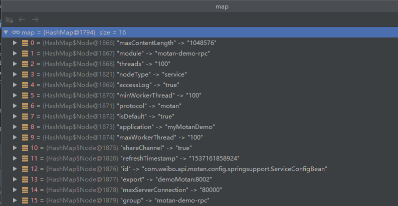

# motan源码分析一 （概要及服务暴露流程源码分析）

# spring集成

通过META-INFO中配置spring.handlers来向spring容器注册

```properties
http\://api.weibo.com/schema/motan=com.weibo.api.motan.config.springsupport.MotanNamespaceHandler
```

spring.schemas描述配置xml语法

```properties
http\://api.weibo.com/schema/motan.xsd=META-INF/motan.xsd
```

## 初始化

```java
@Override
    public void init() {
        registerBeanDefinitionParser("referer", new MotanBeanDefinitionParser(RefererConfigBean.class, false));
        registerBeanDefinitionParser("service", new MotanBeanDefinitionParser(ServiceConfigBean.class, true));
        registerBeanDefinitionParser("protocol", new MotanBeanDefinitionParser(ProtocolConfig.class, true));
        registerBeanDefinitionParser("registry", new MotanBeanDefinitionParser(RegistryConfig.class, true));
        registerBeanDefinitionParser("basicService", new MotanBeanDefinitionParser(BasicServiceInterfaceConfig.class, true));
        registerBeanDefinitionParser("basicReferer", new MotanBeanDefinitionParser(BasicRefererInterfaceConfig.class, true));
        registerBeanDefinitionParser("spi", new MotanBeanDefinitionParser(SpiConfigBean.class, true));
        registerBeanDefinitionParser("annotation", new MotanBeanDefinitionParser(AnnotationBean.class, true));
        Initializable initialization = InitializationFactory.getInitialization();
        initialization.init();
    }
```

## ServiceConfigBean，服务暴露流程分析

```java
public void afterPropertiesSet() //伴随Bean初始化后执行，完成读配置的基础工作
public void onApplicationEvent(ContextRefreshedEvent event) //伴随应用上下文启动后执行，完成服务的export动作
public void destroy() //应用申请停止时，会调用bean的destroy方法，这里完成unexport的动作
```

主体流程：

```java
private void checkAndConfigBasicConfig() //检查并配置basicConfig
private void checkAndConfigExport() //检查是否已经装配export，如果没有则到basicConfig查找
private void checkAndConfigRegistry() //检查并配置registry
public synchronized void export() //export暴露服务
public synchronized void unexport() //unexport注销服务
```

前三个方法主要描述一些配置加载，这里先不展开，先来仔细看下export服务暴露的流程

export代码如下：

```java
 public synchronized void export() {
     	//检查服务是否已经export过
        if (exported.get()) {
            LoggerUtil.warn(String.format("%s has already been expoted, so ignore the export request!", interfaceClass.getName()));
            return;
        }
	    //检查接口及方法的配置，并读取参数类型列表
        checkInterfaceAndMethods(interfaceClass, methods);
		//加载注册中心地址URL
        List<URL> registryUrls = loadRegistryUrls();
        if (registryUrls == null || registryUrls.size() == 0) {
            throw new IllegalStateException("Should set registry config for service:" + interfaceClass.getName());
        }
		//加载配置的protocol和port并逐个export
        Map<String, Integer> protocolPorts = getProtocolAndPort();
        for (ProtocolConfig protocolConfig : protocols) {
            Integer port = protocolPorts.get(protocolConfig.getId());
            if (port == null) {
                throw new MotanServiceException(String.format("Unknow port in service:%s, protocol:%s", interfaceClass.getName(),
                        protocolConfig.getId()));
            }
            doExport(protocolConfig, port, registryUrls);
        }
		//初始化加载后的各种flag等信息
        afterExport();
    }
```

doExport代码如下：

```java
   private void doExport(ProtocolConfig protocolConfig, int port, List<URL> registryURLs) {
        // ... 这里省略了几个参数的读取如：protocolName， hostAddress， port等

        Map<String, String> map = new HashMap<String, String>();
		// ... 这里省略了很多加载map参数的代码，详细请参考源代码
		/**
		* map中加载了一些初始化参数，下面贴一张运行时的图，大家可以参考下
		**/
        URL serviceUrl = new URL(protocolName, hostAddress, port, interfaceClass.getName(), map);

        List<URL> urls = new ArrayList<URL>();

        // injvm 协议只支持注册到本地，其他协议可以注册到local、remote
        if (MotanConstants.PROTOCOL_INJVM.equals(protocolConfig.getId())) {
            // 由于我们着重分析基于registry的export流程，INJVM的代码省略
        } else {
            for (URL ru : registryURLs) {
                urls.add(ru.createCopy());
            }
        }
        // 生成motan URL
        for (URL u : urls) {
            u.addParameter(URLParamType.embed.getName(), StringTools.urlEncode(serviceUrl.toFullStr()));
            registereUrls.add(u.createCopy());
        }
		// 加载SPI ConfigHandler插件
        ConfigHandler configHandler = ExtensionLoader.getExtensionLoader(ConfigHandler.class).getExtension(MotanConstants.DEFAULT_VALUE);
		// 调用configHandler插件的export方法暴露服务并保存服务引用
        exporters.add(configHandler.export(interfaceClass, ref, urls));
    }
```

参数map如下：



```java
public static <T> ExtensionLoader<T> getExtensionLoader(Class<T> type)
```

上面这个方法主要是加载SPI的插件，SPI机制这里我们先不展开讲，这个加载会加载到以下实现

```java
@SpiMeta(name = MotanConstants.DEFAULT_VALUE)
public class SimpleConfigHandler implements ConfigHandler {
  	@Override
    public <T> Exporter<T> export(Class<T> interfaceClass, T ref, List<URL> registryUrls) {

        String serviceStr = StringTools.urlDecode(registryUrls.get(0).getParameter(URLParamType.embed.getName()));
        URL serviceUrl = URL.valueOf(serviceStr);

        // export service
        // 利用protocol decorator来增加filter特性
        String protocolName = serviceUrl.getParameter(URLParamType.protocol.getName(), URLParamType.protocol.getValue());
        Protocol orgProtocol = ExtensionLoader.getExtensionLoader(Protocol.class).getExtension(protocolName);
        // 加载service实现类的代理provider
        Provider<T> provider = getProvider(orgProtocol, ref, serviceUrl, interfaceClass);
		// 初始化Protocol的装饰器，装饰器增加export前的filter操作
        Protocol protocol = new ProtocolFilterDecorator(orgProtocol);
        // 调用export方法完成暴露
        Exporter<T> exporter = protocol.export(provider, serviceUrl);

        // register service
        register(registryUrls, serviceUrl);

        return exporter;
    }
}
```

上面的protocol.export默认使用到如下方法：

```java
@SpiMeta(name = "motan")
public class DefaultRpcProtocol extends AbstractProtocol {
    // ...省略其他未调用的方法
    @Override
    protected <T> Exporter<T> createExporter(Provider<T> provider, URL url) {
        return new DefaultRpcExporter<T>(provider, url, this.ipPort2RequestRouter, this.exporterMap);
    }
}
```

最终调用了父类的export方法，如下：

```java
public abstract class AbstractProtocol implements Protocol {
    @Override
    public <T> Exporter<T> export(Provider<T> provider, URL url) {
        // ...check的代码忽略

        String protocolKey = MotanFrameworkUtil.getProtocolKey(url);

        synchronized (exporterMap) {
            Exporter<T> exporter = (Exporter<T>) exporterMap.get(protocolKey);

            if (exporter != null) {
                throw new MotanFrameworkException(this.getClass().getSimpleName() + " export Error: service already exist, url=" + url,
                        MotanErrorMsgConstant.FRAMEWORK_INIT_ERROR);
            }
			// 获取DefaultRpcExporter
            exporter = createExporter(provider, url);
            // init方法最终会调用到DefaultRpcExporter的doInit方法，后续说明
            exporter.init();

            exporterMap.put(protocolKey, exporter);

            LoggerUtil.info(this.getClass().getSimpleName() + " export Success: url=" + url);

            return exporter;
        }


    }
}
```

DefaultRpcExporter的doInit方法，调用server打开端口，等待请求：

```java
 @Override
    protected boolean doInit() {
        boolean result = server.open();

        return result;
    }
```

